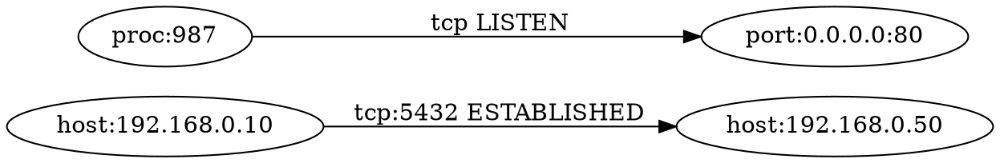

# neteye

```
███╗   ██╗███████╗████████╗███████╗██╗   ██╗███████╗
████╗  ██║██╔════╝╚══██╔══╝██╔════╝╚██╗ ██╔╝██╔════╝
██╔██╗ ██║█████╗     ██║   █████╗   ╚████╔╝ █████╗  
██║╚██╗██║██╔══╝     ██║   ██╔══╝    ╚██╔╝  ██╔══╝  
██║ ╚████║███████╗   ██║   ███████╗   ██║   ███████╗
╚═╝  ╚═══╝╚══════╝   ╚═╝   ╚══════╝   ╚═╝   ╚══════╝
```

[](https://github.com/yutat23neteye/actions)
[](https://goreportcard.com/report/github.com/yutat23neteye)
[](https://opensource.org/licenses/MIT)

A robust cross-platform CLI tool for network connection investigation and monitoring that provides **simple**, **fast**, and **visualizable** network analysis.

## Features

- **Network Connection Listing**: Display current TCP/UDP connections with detailed information
- **Real-time Monitoring**: Watch for new and closed connections with event notifications
- **Connection Visualization**: Generate network relationship graphs in multiple formats
- **Cross-platform Support**: Works seamlessly on Linux, Windows, and macOS
- **Multiple Output Formats**: table, JSON, CSV, and Graphviz DOT formats
- **High Performance**: Executes `list` command within 300ms
- **Lightweight**: Single binary with no external dependencies

## Installation

### From Releases

Download the appropriate binary for your platform from [Releases](https://github.com/yutat23neteye/releases):

```bash
# Linux/macOS
curl -fsSL https://github.com/yutat23neteye/releases/latest/download/neteye-linux-amd64.tar.gz | tar -xz
sudo mv neteye /usr/local/bin/

# Windows (PowerShell)
Invoke-WebRequest -Uri "https://github.com/yutat23neteye/releases/latest/download/neteye-windows-amd64.zip" -OutFile "neteye.zip"
Expand-Archive -Path "neteye.zip" -DestinationPath "."
```

### From Source

```bash
git clone https://github.com/yutat23neteye
cd neteye
go build -o neteye ./cmd/neteye
```

### Using Go Install

```bash
go install github.com/yutat23neteye/cmd/neteye@latest
```

## Usage

```
neteye <command> [options]
```

### Commands

#### `list` - List Network Connections

Display current TCP/UDP connections with detailed information.

```bash
# Basic usage - show all connections
neteye list

# Output in JSON format
neteye list --format json

# Filter by specific process ID
neteye list --pid 1234

# Show only TCP connections
neteye list --proto tcp

# Show only listening connections
neteye list --listen-only

# Filter by remote host
neteye list --remote "192.168.*"

# Resolve IP addresses to hostnames
neteye list --resolve
```

#### `watch` - Monitor Connection Changes

Monitor network connections for real-time changes and new connections.

```bash
# Watch for all connection changes
neteye watch

# Monitor specific port for new connections
neteye watch 443

# Watch with custom interval
neteye watch --interval 1s

# Monitor for 10 seconds only
neteye watch --duration 10s

# Quiet mode - show only changes
neteye watch --quiet
```

#### `map` - Generate Connection Graph

Generate network relationship graphs for visualization.

```bash
# Generate JSON graph
neteye map

# Generate Graphviz DOT format
neteye map --graph dot

# Collapse connections by IP (ignore ports)
neteye map --collapse-ports

# Resolve hostnames in graph
neteye map --resolve

# Generate PNG image from DOT output
neteye map --graph dot | dot -Tpng -o network.png
```

### Output Formats

#### Table Format (Default)

Human-readable tabular output with optional colors:

```
PROTO  LOCAL               REMOTE              STATE        PID  PROC
TCP    192.168.0.10:5432   192.168.0.50:50234  ESTABLISHED  1234 postgres
TCP    0.0.0.0:80          *:*                 LISTEN        987 nginx
UDP    0.0.0.0:53          *:*                 UNKNOWN       456 systemd-resolved
```

#### JSON Format

Machine-readable JSON output for programmatic processing:

```json
[
  {
    "proto": "tcp",
    "local_ip": "192.168.0.10",
    "local_port": 5432,
    "remote_ip": "192.168.0.50",
    "remote_port": 50234,
    "state": "ESTABLISHED",
    "pid": 1234,
    "process": "postgres",
    "created_at": "2025-09-27T13:41:12Z"
  }
]
```

#### CSV Format

Comma-separated values for data analysis:

```csv
proto,local_ip,local_port,remote_ip,remote_port,state,pid,process,created_at
tcp,192.168.0.10,5432,192.168.0.50,50234,ESTABLISHED,1234,postgres,2025-09-27T13:41:12Z
tcp,0.0.0.0,80,0.0.0.0,0,LISTEN,987,nginx,2025-09-27T13:41:12Z
```

#### DOT Format

Graphviz DOT format for network visualization:



## Configuration

Configuration file example can be found at [`configs/neteye.example.yaml`](configs/neteye.example.yaml).

Configuration file locations (in order of precedence):
- `~/.config/neteye/config.yaml`
- `./neteye.yaml`
- Specified with `--config` flag

## Global Options

- `--format <format>`: Output format (table/json/csv)
- `--no-color`: Disable ANSI colors in output
- `--resolve`: Resolve IP addresses to hostnames (with caching)
- `--sort <key>`: Sort by field (proto/local/remote/state/pid/proc)

## Development

### Prerequisites

- Go 1.22 or later
- Git

### Building from Source

```bash
# Clone the repository
git clone https://github.com/yutat23neteye
cd neteye

# Download dependencies
go mod download

# Build for current platform
go build -o neteye ./cmd/neteye

# Cross-platform build
./scripts/release_matrix.sh
```

### Testing

```bash
# Run all tests
go test ./...

# Run tests with coverage
go test -cover ./...

# Run tests with race condition detection
go test -race ./...
```

### Code Quality

```bash
# Run linter
golangci-lint run

# Format code
go fmt ./...
```

## Performance

- **`neteye list`**: Executes within 300ms (local environment)
- **`neteye watch`**: Less than 10% CPU usage (500ms interval monitoring)
- **DNS resolution**: 300ms timeout with result caching
- **Process information**: Bulk collection with caching for optimal performance

## Permissions

Some features may require elevated privileges:

- **Linux**: May need `sudo` for process name retrieval in some cases
- **Windows**: May require administrator privileges for network information access
- **macOS**: May need permissions for `lsof` command execution

When permissions are insufficient, the tool exits with code 3 and outputs error messages to stderr.

## How It Works

### Connection Collection

- **Linux**: Uses `/proc/net/{tcp,udp}` filesystem with `ss` command fallback
- **Windows**: Uses `netstat` command with PowerShell process name resolution
- **macOS**: Uses `lsof -i` command with `netstat` fallback

### Real-time Monitoring

- Efficient connection diffing algorithm for change detection
- Configurable polling intervals with minimal resource usage
- Event-based notifications for new and closed connections

### Graph Generation

- Builds relationship graphs from connection data
- Supports both detailed (per-port) and collapsed (per-host) views
- Outputs in JSON format for programmatic use or DOT format for visualization

### Process Information

- Bulk collection and caching for optimal performance
- Cross-platform process name resolution
- Handles edge cases like system processes and permission restrictions

## Use Cases

- **Network Debugging**: Quickly identify what processes are using network resources
- **Security Monitoring**: Watch for unexpected network connections
- **Performance Analysis**: Monitor connection patterns and resource usage
- **System Administration**: Visualize network topology and relationships
- **Development**: Debug network-related issues in applications

## Contributing

1. Fork the repository
2. Create a feature branch (`git checkout -b feature/amazing-feature`)
3. Commit your changes (`git commit -m 'Add amazing feature'`)
4. Push to the branch (`git push origin feature/amazing-feature`)
5. Open a Pull Request

Please read [CONTRIBUTING.md](CONTRIBUTING.md) for details on our code of conduct and the process for submitting pull requests.

## License

This project is licensed under the MIT License - see the [LICENSE](LICENSE) file for details.

## Acknowledgments

- [spf13/cobra](https://github.com/spf13/cobra) - CLI framework
- [olekukonko/tablewriter](https://github.com/olekukonko/tablewriter) - Table formatting
- Go standard library for robust networking capabilities

## Requirements

- Go 1.22 or later for building from source
- No runtime dependencies (single binary)

---

**neteye** - See through your network connections 👁️‍🗨️
